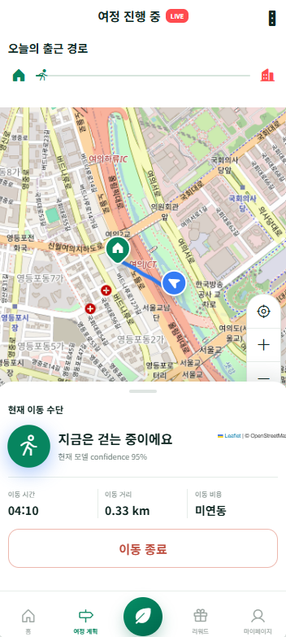

# Canopy

친환경 이동을 했을 때 얼마나 탄소를 줄였는지 보여주고, 실제 이동수단을 나눠서 기록하는 프로젝트

---

## 데이터셋

### KTDB 2021
비슷한 조건의 사람들이 보통 어떻게 이동했는지 계산하는 Population Baseline으로 사용

### GeoLife
실제 GPS 기반 기본 이동수단 모델 학습 데이터로 사용

### AI-Hub 교통수단 판별 데이터
실제 GPS 원천 데이터로 120초 canonical window를 만들어 이동수단 모델을 보완함
예전에 60초 feature 두 개를 붙여서 120초처럼 쓰던 부분이 있었는데 train과 serving feature가 달라지는 문제가 있어서 raw GPS에서 같은 방식으로 다시 계산하도록 함

### 서울 버스 정류장과 지하철, 철도 reference
GPS만으로 애매한 구간을 보완하는 Transit Context로 사용

### evaluation_dataset_v3
generator로 만든 synthetic 데이터라 실제 사용자의 GPS와 같다고 보기 어려움
그래서 frozen blind evaluation 용도로만 보존하고 학습이나 튜닝에는 사용하지 않음

### dataset_v1
이전 generator 데이터는 실제 서울 이동을 제대로 표현하지 못한다고 판단해서 학습과 평가에서 제외
관련 audit와 report는 기록으로만 남겨둠

---

## 지금까지 한 작업

처음에는 GeoLife만으로 기본 모델을 만들었는데 서울 이동수단을 그대로 설명하기에는 부족한 부분 발견

AI-Hub 실제 GPS 데이터를 추가하고 raw GPS에서 120초 feature를 만드는 방식으로 통일

Train, Validation, Test는 UID가 겹치지 않도록 나누고

sampling cadence가 달라져도 feature가 무너지지 않는지 stress test를 진행

버스와 철도 reference가 잘못 연결되는 문제를 고치고 Transit Context를 보조 정보로 연결

Mock GPS Replay를 전체 Integration Pipeline에 연결

Movement, Temporal, Transit, Final 결과와 CO2, Reward를 한 화면에서 확인할 수 있게 제작 

화면은 Home, 여정 계획, 여정 시작, 이동 중, 여정 완료 흐름으로 이어지게 만들었고 실제 앱처럼 보이도록 주소, 지도, 이동수단, 탄소 절감량을 같이 표시

---

## 현재 성능

최종 Test 기준

Movement Accuracy 0.6984
Movement Macro F1 0.6770
Final Accuracy 0.7080
Final Macro F1 0.6888

walk F1 0.839
bike F1 0.565
car F1 0.706
bus F1 0.629
rail F1 0.704

Validation Final Macro F1은 0.7307

---

## 현재 데모에서 되는 것

Home에서 이번 달 탄소 절감량과 목표, 주간 이동 요약을 확인

여정 계획에서 집과 직장의 실제 주소, 추천 경로, 예상 시간과 탄소 배출량을 확인

여정 시작 화면에서 출발지와 목적지를 확인

이동 중에는 현재 위치를 지도에서 따라가고 현재 이동수단과 이동 거리, 시간을 표시

여정이 끝나면 감지된 이동수단별 거리와 탄소 배출량, 예상 이동과 비교한 절감량, Reward를 보여줌

Mock 결과는 walk, rail, walk 흐름으로 나오고 rail 구간은 서울 reference와 연결해서 표시함

---

## 아직 남은 것

현재 모델은 연구와 데모 기준으로 정리된 상태이고 모든 이동수단을 상용 수준으로 보장하는 단계는 아님

bike와 bus는 walk나 rail보다 성능이 낮아서 실제 사용자 데이터로 추가 검증이 필요

현재 서울 학습 데이터는 따로 없고 AI-Hub와 GeoLife를 기준으로 만든 상태

evaluation_dataset_v3는 synthetic 데이터라 실제 서비스 성능을 대표한다고 보면 안 됨

모바일 앱 연동과 사용자별 집, 직장 주소 저장은 아직 별도 구현이 필요

---

## UI 확인 화면

### Home

### 이동 중

### 이동 완료

