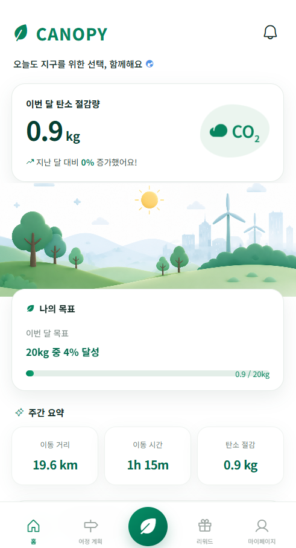
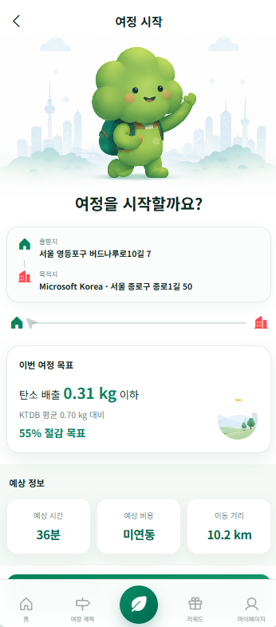
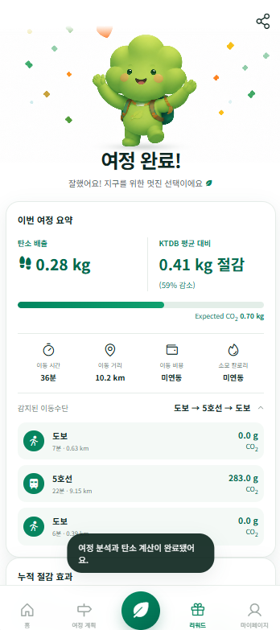

# Canopy Data Platform

Canopy는 친환경 이동을 했다는 이유만으로 보상하는 서비스가 아니다. 비슷한 시간과 지역에서 사람들이 보통 어떻게 이동했는지와 사용자의 실제 이동을 비교해서 저탄소 방향으로 바뀌었는지를 계산한다.

## 지금 main에 들어온 작업

- KTDB 2021 데이터로 Expected Behaviour와 Population Baseline을 만든다.
- GeoLife와 AI-Hub 실제 GPS로 이동수단을 예측한다.
- 서울 버스, 지하철, 철도 reference로 GPS 결과를 보완한다.
- GPS Replay로 iPhone 형식의 이벤트를 받아 120초 Window 단위로 처리한다.
- Expected CO2, Actual CO2, CO2 Reduction과 Token Reward를 계산한다.
- Local UI에서 출근 전, 이동 중, 이동 완료 화면을 확인할 수 있다.

## 사용한 데이터

KTDB 개인통행실태조사 2021 데이터는 Population Baseline에 사용했다.

GeoLife는 기본 GPS 이동수단 학습 데이터로 남겨두었다.

AI-Hub 교통수단 판별 데이터는 실제 GPS 원본에서 고정 120초 Window를 다시 만들고 학습했다. 예전에 사용하던 60초 요약 행 두 개를 합치는 방식은 train-serving skew가 있어서 production 경로에서 제거했다.

서울 버스와 지하철 reference는 Transit Context에서 사용한다. `evaluation_dataset_v3`는 synthetic 평가용으로만 보관하고 학습이나 모델 선택에는 사용하지 않는다.

## 여기까지 만든 과정

1. 기존 모델과 처리 경로를 먼저 확인했다.
2. 학습과 runtime의 Feature가 같은지 비교했다.
3. AI-Hub 원본 GPS에서 120초 Window와 canonical Feature를 만들었다.
4. 사용자 기준으로 Train, Validation, Test를 나누고 UID가 겹치지 않는지 확인했다.
5. robust Feature와 cadence 학습 후보를 비교하고 Validation Macro F1로 모델을 골랐다.
6. 실제 Test에서 Movement, Temporal, Transit, Final 단계를 각각 확인했다.
7. Transit resolver가 고신뢰 rail 결과를 bus나 car로 바꾸던 문제를 수정했다.
8. Mock GPS를 기존 Replay와 전체 Integration Pipeline에 넣어 결과를 확인했다.
9. 전체 테스트를 돌린 뒤 main에 merge했다.

## 최종 성능

최종 Test 단계 결과는 다음과 같다.

- Movement Accuracy: 0.6984
- Movement Macro F1: 0.6770
- Final Accuracy: 0.7080
- Final Macro F1: 0.6888
- walk F1: 0.839
- bike F1: 0.565
- car F1: 0.706
- bus F1: 0.629
- rail F1: 0.704

Validation Final Macro F1은 0.7307이었다.

Mock 결과는 `walk → rail → walk`로 나왔고, rail 구간은 서울 reference의 5호선으로 연결됐다.

상세 결과는 [AI-Hub runtime parity release](reports/aihub/AIHUB_RUNTIME_PARITY_RELEASE.md)와 [release checklist](reports/aihub/AIHUB_RUNTIME_PARITY_RELEASE_CHECKLIST.md)에 정리했다.

## UI 확인 화면

현재 저장된 Local UI 확인 화면이다.

### Home



### 이동 중



### 이동 완료



## 실행 방법

저장소 루트에서 실행한다.

```powershell
python -m pip install -r requirements.txt
```

AI-Hub 모델을 새로 만들 때는 원본 데이터 경로를 지정한다.

```powershell
$env:AIHUB_DATA_ROOT = "C:\path\to\01-1.정식개방데이터"
.\scripts\rebuild_aihub_production.ps1
```

모델과 주요 reference를 확인한다.

```powershell
python scripts/validate_integration_artifacts.py
```

Mock GPS를 직접 확인한다.

```powershell
python -m scripts.evaluate_mock_trip --csv mock/canopy_iphone_mock_yeongdeungpo_to_microsoft.csv --ground-truth mock/canopy_iphone_mock_yeongdeungpo_to_microsoft_ground_truth.txt --output reports/aihub/AIHUB_RUNTIME_PARITY_MOCK_AFTER.json
```

Local UI를 실행한다.

```powershell
python scripts/run_integration_ui.py
```

브라우저에서 `http://127.0.0.1:8765`를 연다.

전체 테스트는 다음 명령으로 실행한다.

```powershell
python -m pytest -q
```

## 현재 제한

- 모델 파일은 용량 때문에 Git에 올리지 않는다. 새 환경에서는 AI-Hub 원본으로 다시 만들어야 한다.
- 10초 cadence에서는 성능이 떨어져 기본 학습 선택에서 제외했다.
- 실제 장시간 iPhone GPS 로그와 bike-labelled Transit 데이터는 아직 없다.
- 현재 수치는 개선됐지만 다섯 가지 이동수단을 항상 정확하게 맞히는 수준은 아니다.

## Branch

현재 결과는 `main`에 merge되어 있다. 모델 개선 과정과 평가 자료는 `feature/mobility-runtime-parity-v3`의 Git History에서 확인할 수 있다.
